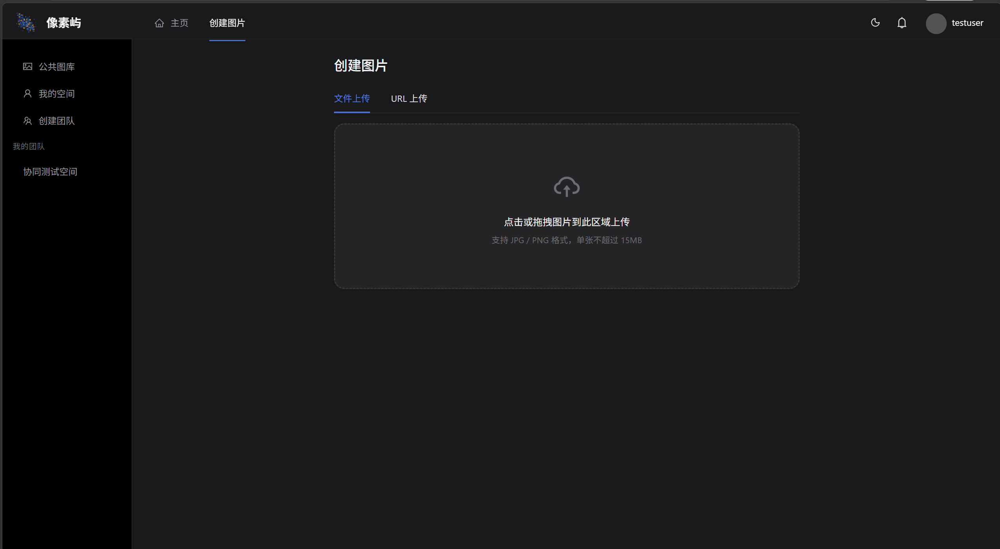
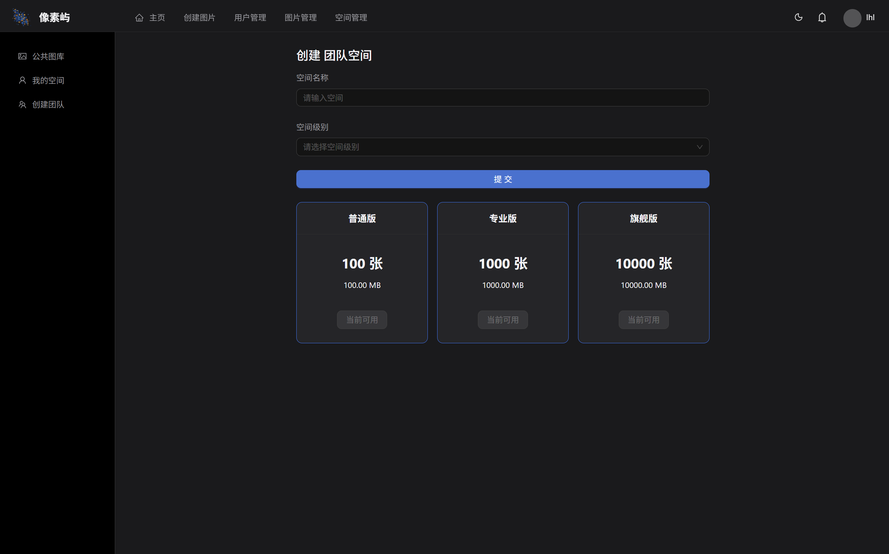
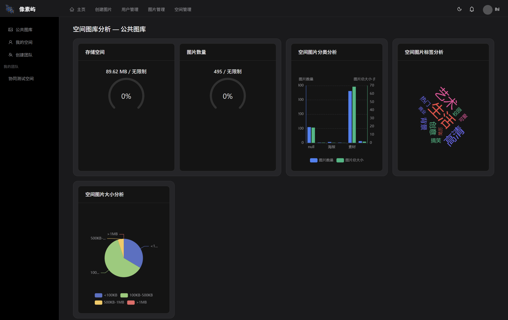
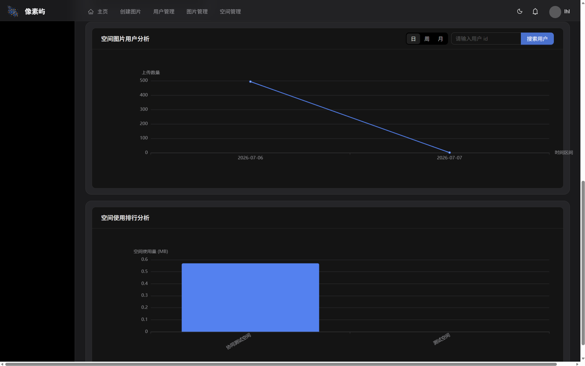
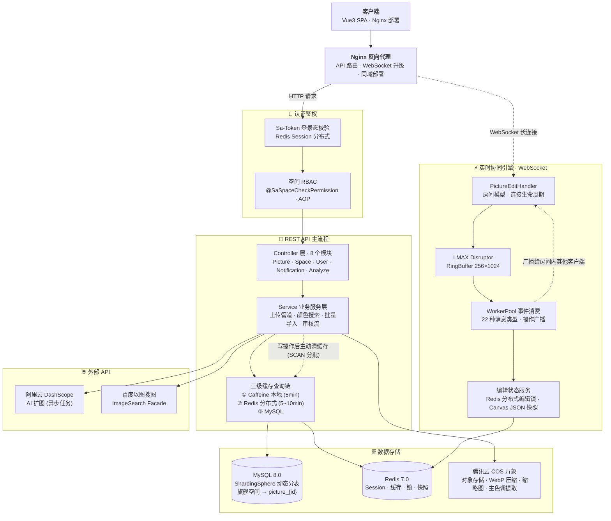

# 像素屿（Pixel Isle）

> 云图库 & 多人实时协同编辑平台

🌐 **在线演示：[lhllhl.cn](https://lhllhl.cn)**

[](https://spring.io/projects/spring-boot)
[](https://openjdk.org/)
[](https://www.mysql.com/)
[](https://redis.io/)
[](https://developer.mozilla.org/en-US/docs/Web/API/WebSocket)
[](LICENSE)

---

## ✨ 核心功能

### 图片管理

- **上传** — 文件直传 + URL 拉取，支持批量导入
- **智能处理** — 自动 WebP 转换、压缩、缩略图生成、主色调提取（腾讯云 COS 万象）
- **审核工作流** — 待审 → 通过 / 驳回，公共图库仅展示通过内容
- **编辑** — 裁剪、旋转、缩放、画笔、文字标注、滤镜（灰度 / 复古 / 反色 / 模糊 / 锐化）
- **搜索** — 关键词搜索、分类筛选、标签过滤、颜色搜索、百度以图搜图



### 空间体系（多租户）

- **私有空间** — 个人图库，独立配额管理
- **团队空间** — 多人协作空间，三级角色（查看者 / 编辑者 / 管理员）
- **三级空间** — 普通（100 张 / 100MB）、专业（1000 张 / 1000MB）、旗舰（10000 张 / 10000MB）
- **动态分表** — 旗舰级团队空间自动创建独立分表，隔离大数据量场景



### 🔥 实时协同编辑（核心亮点）


> **左：用户 A 编辑中** ｜ **右：用户 B 实时收到同步更新（WebSocket 推送）**

- **WebSocket 长连接** — 同一图片的编辑用户进入同一个 WebSocket 房间
- **编辑锁** — 基于 Redis SETNX 的分布式锁，同一时刻仅一人可编辑
- **操作广播** — 对象增删改移、裁剪、滤镜、缩放平移等全部实时同步给房间内所有用户
- **状态快照** — 服务端维护完整画布状态 JSON，新加入用户一键同步当前进度
- **远程指示器** — 可看到其他用户的选中框/光标位置（类似 Figma）
- **LMAX Disruptor** — 高吞吐环形缓冲队列处理编辑事件，支撑高并发广播

### 通知系统

- 团队邀请（发送 / 接受 / 拒绝）
- 联系管理员（多轮回复）
- 轮询未读计数 + 页面标题闪烁提醒

### AI 能力

- **图像扩绘** — 接入阿里云 DashScope API，异步任务创建与状态轮询
- **以图搜图** — 接入百度反向图片搜索，外观模式可替换搜索引擎

### 数据分析

- 空间用量概览（存储 / 数量 / 配额使用率）
- 分类分布 / 标签词云 / 文件大小分布 / 用户上传行为
- 公共空间排行榜（管理员）





---

## 🏗️ 后端架构



---

## 🔧 技术亮点

### 1. 实时协同编辑

```
用户 A 编辑 → WebSocket 消息 → Disruptor RingBuffer
                                    ↓
                              WorkerPool 消费
                                    ↓
                        广播给房间内所有其他用户（用户 B、C…）
                                    ↓
                        更新 Redis Canvas 快照（新加入者同步用）
```

- **22 种消息类型**：从进入/退出编辑、对象 CRUD、裁剪滤镜，到心跳 PING/PONG
- **分布式编辑锁**：`SET picture_edit_lock:{pictureId} userId NX EX 3600`，保证同一时间仅一人可编辑
- **相对坐标协议**：所有位置信息使用相对坐标（`relLeft` / `relTop` / `relWidth` / `relHeight`），适配不同客户端视口大小
- **新用户状态同步**：`SYNC_START → SYNC_HISTORY（全量快照）→ SYNC_END` 三步握手，新加入用户秒级追齐
- **启动清理**：应用启动时自动清除残留的编辑锁，防止脏数据

### 2. 动态分表（ShardingSphere）

```
public 图片 → picture 表
旗舰团队空间 A → picture_{spaceId_A} 表（动态创建）
旗舰团队空间 B → picture_{spaceId_B} 表（动态创建）
...
```

- 基于 `spaceId` 的自定义分片算法
- 运行时动态更新 `actual-data-nodes`，无需重启

### 3. JSON 驱动的 RBAC

```json
{
  "viewer":  ["picture:view"],
  "editor":  ["picture:view", "picture:upload", "picture:edit"],
  "admin":   ["picture:view", "picture:upload", "picture:edit",
              "picture:delete", "spaceUser:manage"]
}
```

- 自定义 `@SaSpaceCheckPermission` 注解 + AOP 拦截
- 双层鉴权：用户级（user/vip/admin）+ 空间级（viewer/editor/admin）

### 4. 图片处理管道

```
用户上传 → 格式校验（jpeg/png/webp/bmp，≤15MB）
          → 上传到 COS
          → COS 万象：WebP 转换 + 压缩（质量 80%）
          → 若 > 20KB：生成 512×512 缩略图
          → 删除原始文件
          → 提取元数据（宽/高/比例/格式/主色调）
          → 设置 30 天浏览器缓存
          → 持久化到数据库
```

### 5. 多级缓存策略

| 层级 | 技术 | TTL | 用途 |
|------|------|-----|------|
| 浏览器 | Cache-Control | 30 天 | 已处理图片 |
| 本地 | Caffeine | 5 分钟 | 图片列表 + 空间分析 |
| 分布式 | Redis | 5~10 分钟（随机防雪崩） | 图片列表 + 空间分析，跨实例共享 |

**缓存失效**：私有/团队空间的写操作后通过 SCAN 分批清除匹配的 Redis key + Caffeine key。公共图库不手动清，依赖 TTL 自然过期。

**三级查询链**：Caffeine → Redis → MySQL，上层命中即返回。

### 6. 颜色相似度搜索

```
用户选择目标颜色（Hex）
        ↓
数据库预筛选：同空间 + 审核通过 + picColor 非空 → LIMIT 500
        ↓
内存排序：Euclidean 距离计算相似度（R/G/B 三维空间）
        ↓
返回 Top 12 最相似图片
```

- **算法**：`ColorSimilarUtils` 基于 RGB 三维欧氏距离，返回值 0~1（1 为完全相同）
- **性能设计**：数据库 LIMIT 500 缩小候选集，内存排序取 Top 12
- **安全**：`@SaSpaceCheckPermission(PICTURE_VIEW)` 鉴权 + `NumberFormatException` 兜底

---

## 🛠️ 技术栈

| 层级 | 技术 | 说明 |
|------|------|------|
| **框架** | Spring Boot 2.7.6 | 后端主应用框架 |
| **语言** | Java 8 | JDK 版本 |
| **ORM** | MyBatis-Plus 3.5.9 | 数据库操作 + 代码生成 |
| **数据库** | MySQL 8.0 | 主数据存储 |
| **分库分表** | ShardingSphere-JDBC 5.2.0 | 动态分表策略 |
| **缓存** | Redis 7.0 + Caffeine 2.9 | 分布式 + 本地双层缓存 |
| **认证鉴权** | Sa-Token 1.39 + Spring Session | 用户认证 + 空间 RBAC |
| **API 文档** | Knife4j 4.4（Swagger） | 自动生成接口文档 |
| **对象存储** | 腾讯云 COS | 图片存储 + 万象图片处理 |
| **实时通信** | Spring WebSocket | 协同编辑实时推送 |
| **事件队列** | LMAX Disruptor 3.4 | 高吞吐环形缓冲区 |
| **AI** | 阿里云 DashScope | 图像扩绘 |
| **前端** | Vue 3 + Vite + Ant Design Vue | SPA 单页应用 |
| **工具库** | Hutool 5.8、Jsoup、Lombok | 通用工具 / HTML 解析 / 简化代码 |

---

## 📂 项目结构

```
pixelisle/
├── backend/                                # Spring Boot 后端
│   ├── database/
│   │   └── schema.sql                      # 数据库建表脚本
│   ├── src/main/java/.../pixelisle/
│   │   ├── PixelIsleApplication.java       # 启动入口
│   │   ├── controller/                     # REST 控制器（8 个模块）
│   │   ├── service/                        # 业务逻辑
│   │   ├── management/
│   │   │   ├── auth/                       # 空间 RBAC 鉴权
│   │   │   ├── sharding/                   # 动态分表管理
│   │   │   ├── update/                     # 上传策略（模板方法）
│   │   │   └── webscoket/                  # WebSocket 实时协同
│   │   │       ├── disruptor/              #   Disruptor 环形缓冲
│   │   │       └── model/                  #   消息模型
│   │   ├── model/                          # 实体 / DTO / VO / 枚举
│   │   └── utis/                           # 工具类
│   ├── src/main/resources/
│   │   ├── application.yml                 # 主配置
│   │   └── biz/spaceUserAuthConfig.json    # RBAC 权限配置
│   └── pom.xml
├── frontend/                               # Vue 3 前端
│   ├── src/
│   │   ├── pages/                          # 页面组件
│   │   ├── components/                     # 通用组件
│   │   ├── api/                            # API 调用
│   │   ├── stores/                         # Pinia 状态管理
│   │   └── router/                         # 路由配置
│   └── package.json
└── README.md                               # 本文件
```

---

## 🚀 本地运行

### 环境要求

| 组件 | 版本 | 用途 |
|------|------|------|
| JDK | 8+ | 编译运行 |
| Maven | 3.6+ | 构建 |
| Node.js | 18+ | 前端构建 |
| MySQL | 8.0 | 数据存储 |
| Redis | 7.0 | 缓存 / Session / 协同编辑锁 |

### 后端

```bash
cd backend

# 创建数据库（首次）
mysql -u root -p < database/schema.sql

# 修改 src/main/resources/application.yml 中的数据库/Redis 连接信息

# 启动
mvn spring-boot:run -Dspring-boot.run.profiles=local

# API 文档 → http://localhost:8123/api/doc.html
```

### 前端

```bash
cd frontend
npm install
npm run dev
# 开发服务器默认代理 API 到 localhost:8123
```

> **提示**：生产环境建议使用 Nginx 反向代理前后端，同域名同端口，避免跨域问题。

---

## 📄 API 文档

启动后端后访问 Knife4j（Swagger）：

```
http://localhost:8123/api/doc.html
```

| 路径前缀 | 模块 | 说明 |
|----------|------|------|
| `/api/user` | 用户管理 | 注册 / 登录 / 信息管理 |
| `/api/picture` | 图片管理 | 上传 / 编辑 / 删除 / 搜索 |
| `/api/space` | 空间管理 | 创建 / 更新 / 配额 |
| `/api/spaceUser` | 空间成员 | 邀请 / 角色管理 |
| `/api/space/analyze` | 空间分析 | 用量 / 分类 / 标签统计 |
| `/api/notification` | 通知系统 | 消息推送与管理 |
| `/api/ws/picture/edit` | WebSocket 协同编辑 | 实时操作同步 |

---

## 📝 关于本项目

本项目以 Spring Boot 为核心，深入实践了企业级后端开发的完整技术链路：分层架构设计、数据库分库分表、多级缓存策略、WebSocket 实时通信、分布式锁、RBAC 权限模型、第三方服务集成（对象存储、AI API）、前后端分离部署。

后端代码由我独立完成全部架构设计、编码与部署。前端界面用于功能演示与用户体验展示。

---

> 如果你觉得这个项目不错，欢迎给个 ⭐ Star！
